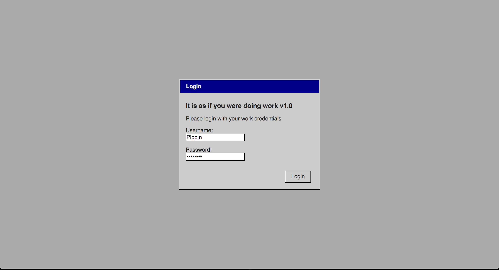
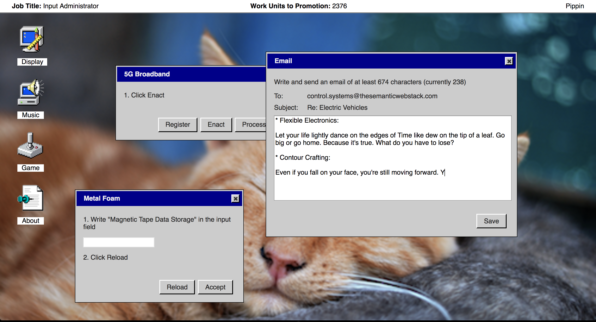
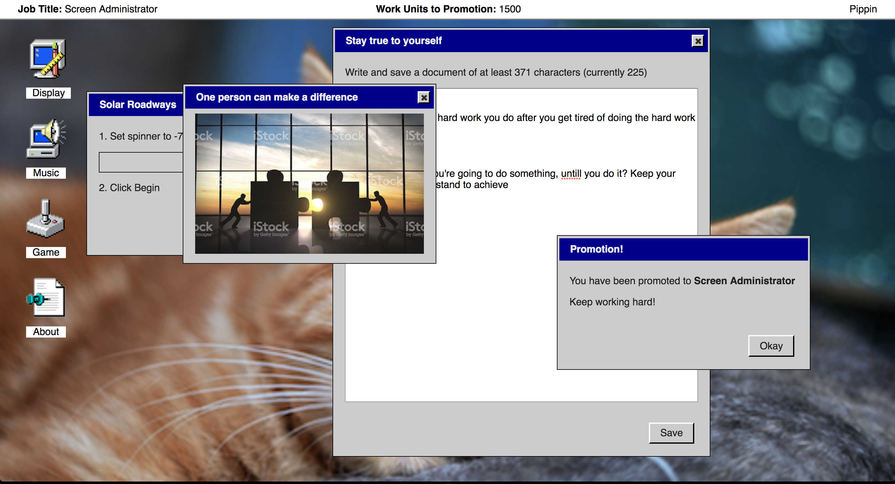
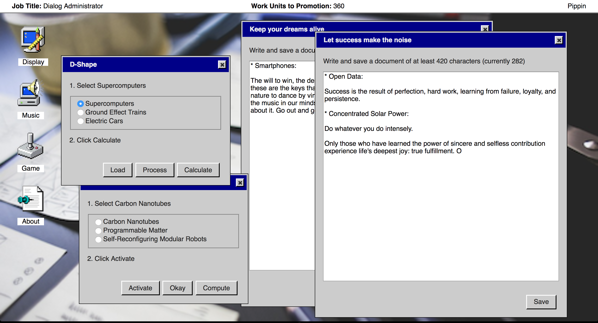

# _It is as if you were doing work_ Press Kit

#### [Play _It is as if you were doing work_ in your browser](https://pippinbarr.github.io/itisasifyouweredoingwork/) (probably not mobile-friendly, sorry)

## The basics

* Developer: [Pippin Barr](http://www.pippinbarr.com/)
* Release: 5th of July, 2017, 11:00 EST
* Platform: Browser (probably mobile-unfriendly)
* Code repository: https://www.github.com/pippinbarr/itisasifyouweredoingwork/
* Price: $0.00

## Description

_The robots are here! No more work! It's great! Is it great?! Wait! You feel apathetic and unproductive! You miss clicking buttons! You miss waiting for progress bars! You miss checkboxes! You miss work! But it's going to be okay! Use this handy application and it is as if you were doing work!_

## Who is this Pippin Barr guy?

Pippin is an Assistant Professor in the [Department of Design and Computation Arts](http://www.concordia.ca/finearts/design.html) at [Concordia University](http://www.concordia.ca/) in Montréal. 

I'm the associate director of the [TAG Lab](http://tag.hexagram.ca/), part of the [Milieux](http://milieux.concordia.ca/) Institute for Arts, Culture, and Technology.

## History

_It is as if you were doing work_ had been around for a long time before I really managed to start working on it properly. I actually documented the original moment that sparked that game in a blog post titled [Close analysis of having a game idea](http://www.pippinbarr.com/2016/08/15/close-analysis-of-having-a-game-idea/) - basically I was watching Rilla resizing an image while working on a project and suddenly felt like it would be amazing to have a game entirely premised on totally conventional operations with traditional user-interfaces. From there it became the idea of a WarioWare-esque game where you would complete simple interface operations under time pressure (I will likely return to this) with various ideas for layering on some kind of meta-narrative, or AI-twist, or something to make it more 'spectacular'.

After a couple of months with it on the back-burner, I came back to the game thinking mostly in terms of technologies. Specifically, I was teaching a web development course at university and started thinking it would be interesting to build a game using a kind of standard-issue user-interface library like jQuery as opposed to building it with a game engine. It felt like there was something appropriate about using tools that actually fit in with the nature of the game as interface-oriented. So at that point I started nailing down what I'd actually be able to implement with jQuery UI's tools (e.g. checkboxes, radio buttons, buttons, progress bars, etc.).

At a certain point while working on the actual underlying framework I tried to name the game and realised it could actually serve as a kind of sequel to _It is as if you were playing chess_, hence: _It is as if you were doing work_. The title gave some more structure to what the game was meant to be about. Rather than being WarioWare-style zany fun with interface elements, it now needed to fit into the _It is as if_ idea of a performative game that enables you to simulate an activity.

Making the game a sequel briefly led me down a path of trying to make an incredibly abstract version where there was little to no actual language and the texts were represented with unicode block characters instead. The UI was styled in a similar way to _It is as if you were playing chess_ with clean white lines on a dark grey. It actually looked pretty good, but it became so abstract that it was less and less clear that the was about anything. When playing around with the interface elements I had a feeling of detachment, rather than the sense of simulating work.

I had a break-through on this front in New Zealand when I decided to style in interface so it looked like Windows 95 to some extent. Having a kind of clunky 'old-timey' UI style made the game lighter hearted and also allowed me to go back to thinking about actually legible content for the interfaces. It pretty quickly settled into more of a desktop OS model of windows and dialogs popping up, with the user performing tasks that both looked and felt like work: typing, moving sliders, clicking on icons.

With the look settled, the content started being decided by the fact I was thinking about this project as part of the [Speculative Play](http://www.speculativeplay.com/) project I'm part of with my colleagues Rilla Khaled (who also happens to be my wife) and Chris Moore. That project is about creative interactive, playful media that speaks to alternate presents or near/distant futures. I positioned _It is as if you were doing work_ in the context of the apparently near future of automated work (I read [_Rise of the Robots_](https://www.amazon.ca/Rise-Robots-Technology-Threat-Jobless/dp/0465097537) by Martin Ford recently in this vein). Thus the game poses as an application that humans who have been put out of work by robots and AI can play as a way to recapture the sense they once had of doing work and being productive. It's a kind of semi-condescending service offered by this new world to those of us who can't deal with it.

And that's how the game came together.

(You can see the game's [process documentation](https://github.com/pippinbarr/itisasifyouweredoingwork/tree/master/process) for far more information about its development than you could possibly want.)

## Technology/Media

_It is as if you were doing work_ is written in JavaScript using [jQuery](http://www.jquery.com/) and [jQuery UI](http://www.jqueryui.com/), two of the quintessential libraries for web development. The sound effects for _It is as if you were doing work_ are pulled from Windows 95 and Windows 98 system sounds, while the music was generated using [Wolfram Tones](http://tones.wolfram.com/). The desktop icons in the game are from Windows 95, the desktop pictures are all creative-commons zero-attribution or public domain, and the inspirational images are all watermarked stock images of work. The technology names are from Darius Kazemi's amazing [corpora on GitHub](https://github.com/dariusk/corpora/tree/master/data/technology). The theming of the dialog boxes was created in jQuery UI's [ThemeRoller](https://jqueryui.com/themeroller/).

_It is as if you were doing work_ is an open source game licensed under a [Creative Commons Attribution-NonCommercial 3.0 Unported License](http://creativecommons.org/licenses/by-nc/3.0/). You are looking at the code (and process and press) repository right now.

## Features

* Text areas!
* Checkboxes!
* Radio buttons!
* Sliders!
* Date pickers!
* Progress bars!
* Buttons!
* Inspirational stock photos!
* Videogame!

## Videos

### [_It is as if you were doing work_ Trailer](https://www.youtube.com/watch?v=RDMiRiHcezI)

## Images

     

## Press

* O'Connor, Alice. [_It is as if you were doing work really is_](https://www.rockpapershotgun.com/2017/07/04/free-desktop-work-simulator/). 4 July 2017. Rock, Paper, Shotgun.
* Beschizza, Rob. [_It Is As If You Were Doing Work is a browser game celebrating Windows 3-era cubicle drudgery_](http://boingboing.net/2017/07/04/it-is-as-if-you-were-doing-wor.html). 4 July 2017. Boing Boing.
* [_Канадец создал симулятор офисного работника. Сыграйте в него на работе_](https://meduza.io/shapito/2017/07/04/kanadets-sozdal-simulyator-ofisnogo-rabotnika-sygrayte-v-nego-na-rabote). 4 July 2017. Meduza.
* Porreca, Ray. [_This browser game simulates workplace tedium and soul-crushing, endless memos_](https://www.destructoid.com/this-browser-game-simulates-workplace-tedium-and-soul-crushing-endless-memos-446844.phtml). 4 July 2017. Destructoid.

## Additional Links

* [Developer blog posts about _It is as if you were doing work_](http://www.pippinbarr.com/search.html?q=%22it%20is%20as%20if%20you%20were%20doing%20work%22)

* [E-tray Exercise](https://www.wikijob.co.uk/content/aptitude-tests/test-types/e-tray-exercise) - Real world dystopian interface to train people to work with email
* [In Europe, Fake Jobs Can Have Real Benefits](https://www.nytimes.com/2015/05/31/business/international/in-europe-fake-jobs-can-have-real-benefits.html) - New York Times article about fake businesses used for training

## Credits

* Pippin Barr: everything.

## Contact

* Email: [pippin.barr+press@gmail.com](mailto:pippin.barr+press@gmail.com)
* Website: [www.pippinbarr.com](http://www.pippinbarr.com/)
* Twitter: [@pippinbarr](https://www.twitter.com/pippinbarr)
* Instagram: [@pippinbarr](https://www.instagram.com/pippinbarr)
* Facebook: [Pippin Barr](http://www.facebook.com/pippin.barr)
